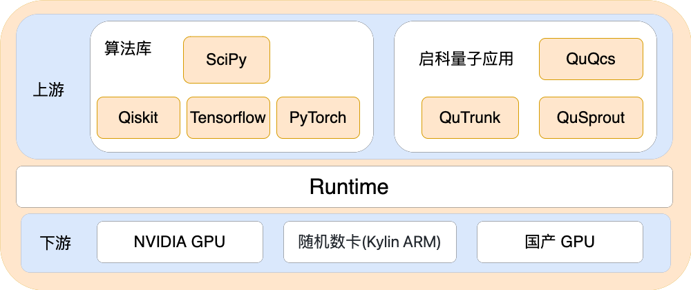

# Runtime

##  **概述**

---
`Runtime` 是启科量子自主研发的一款免费、开源的提供运行环境的工具，可以快速实现量子算法、GPU、随机数卡等环境部署。支持算法公共库整合，一键安装所需算法组件;
支持软硬件结合、提供硬件底层库驱动。

## 功能架构

---

## Runtime 的优势

---

- 上游接入算法库和量子应用，实现启科量子应用环境和出色的量子算法库的整合
- 下游实现软硬结合，提供硬件底层库驱动，支持 `NVIDIA GPU` 卡，量子随机数卡和国产 `GPU` 卡，
省去繁琐的驱动安装配置
- 具有灵活拓展性，支持扩展更多的定制化环境和国产 `GPU` 卡
- 具有并发高效性，支持同时控制安装多台主机

## 安装指南

---

| [00-部署机安装说明](./docs/setup/00-ops_install.md) | [01-Runtime命令说明](./docs/setup/01-runtime_cmd.md) | [02-Runtime配置说明](./docs/setup/02-runtime_config.md) | [03-应用环境安装说明](./docs/setup/03-install_env.md) | 
|------------------------------|--------------------------------------------------|---------------------------------------------------|---------------------------------------------|

## **其他文档**

### 量子应用

- [QuTrunk](https://github.com/qudoor/qutrunk) 是启科量子自主研发的一款免费、开源、跨平台的量子计算编程框架，包括量子编程 API、量子命令转译、量子计算后端接口等
- [QuSprout](https://github.com/qudoor/qusprout) 是启科量子自主研发的一款免费、开源的量子计算模拟后端
- [QuQcs](./QuQCS/README.md) 是基于 NVIDIA cuQuantum 开发的量子线路模拟器，可与启科量子编程框架QuTrunk集成，实现基于本地GPU服务器的量子线路模拟计算加速
---

* [FAQ](./docs/FAQ.md)

* [行为准则](./CODE_OF_CONDUCT.md)
## **如何参与开发**

---

1. 阅读源代码，了解我们当前的开发方向
2. 找到自己感兴趣的功能或模块
3. 进行开发，开发完成后自测功能是否正确
4. Fork 代码库，将修复代码提交到 Fork 的代码库
5. 发起 pull request
6. 更多详情请参见[链接](./docs/CONTRIBUTING.md)

## **许可证**

---
* Runtime 是自由和开源的，在 Apache 2.0 许可证版本下发布。
