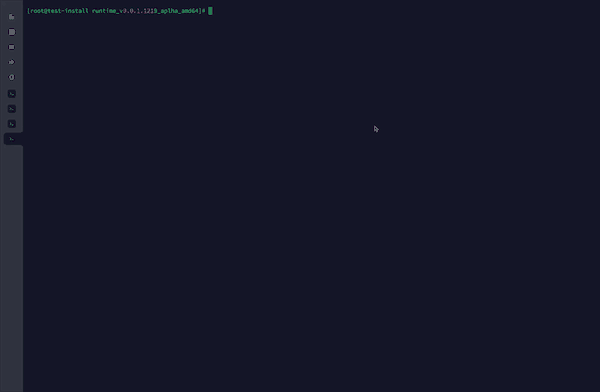
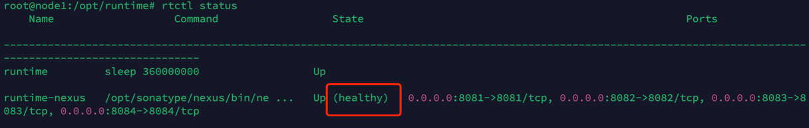

# 安装部署
## 服务器硬件要求(最小化配置)
 <table>
        <thead>
            <tr>
                <th>角色</th>
                <th>CPU核数</th>
                <th>内存</th>
                <th>系统盘</th>
                <th>数量</th>
            </tr>
        </thead>
        <tbody>
            <tr>
                <td>部署机</td>
                <td>2</td>
                <td>4G</td>
                <td>100G</td>
                <td>1</td>
            </tr>
            <tr>
                <td>Worker</td>
                <td>4</td>
                <td>8G</td>
                <td>100G</td>
                <td>1</td>
            </tr>
        <tbody>
    </table>

## 运行环境对硬件要求
<table>
        <thead>
            <tr>
                <th>应用</th>
                <th>GPU卡</th>
                <th>系统</th>
                <th>支持架构</th>
            </tr>
        </thead>
        <tbody>
            <tr>
                <td>qutrunk</td>
                <td>不需要</td>
                <td>ubuntu22/20 centos7</td>
                <td>amd64/arm64</td>
            </tr>
            <tr>
                <td>qusprout</td>
                <td>不需要</td>
                <td>ubuntu22/20 centos7</td>
                <td>amd64/arm64</td>
            </tr>
            <tr>
                <td>quqcs</td>
                <td>需要</td>
                <td>ubuntu22/20 centos7</td>
                <td>amd64</td>
            </tr>
            <tr>
                <td>量子算法</td>
                <td>不需要</td>
                <td>ubuntu22/20 centos7</td>
                <td>amd64/arm64</td>
            </tr>
        <tbody>
    </table>

## 安装说明


## 准备
* 准备一台不小于2核4G，硬盘不小于40G的64位Linux主机
* 通过[官网](http://nexus.queco.cn/repository/qudoor-raw/runtime/0.0.1/runtime_v0.0.1_1223_amd64.tar.gz)下载完整安装包到服务器上，使用root执行文件夹里INSTALL.sh安装脚本

    ```shell
    # 解压安装包
    tar zxvf runtime_release_v0.0.1_amd64.tar.gz
    cd runtime_release_v0.0.1_amd64
    #运行安装脚本
    /bin/bash INSTALL.sh
    #待安装完成后，
    rtctl status
    ```
    

## 安装说明
* 安装脚本会安装 Docker 运行环境，部署机若存在 Docker 环境则跳过安装
* 部署机环境支持 Docker v18+和 Docker-compose v2


## 验证

- 测试是否安装成功,若有有异常，可以使用 rtctl restart 命令进行重新启动
    ```shell
    rtctl status
    ```
    `rtctl` 命令生效，state 为 healthy 表示运行成功

    
