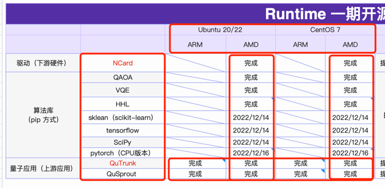
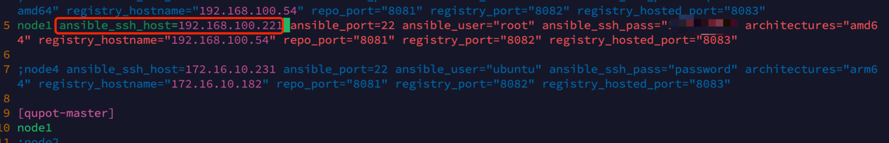
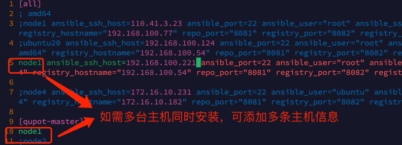
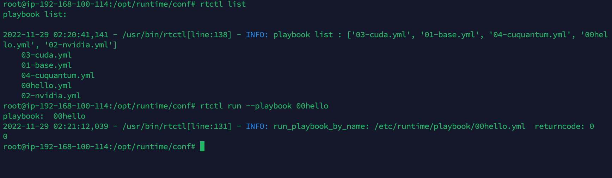
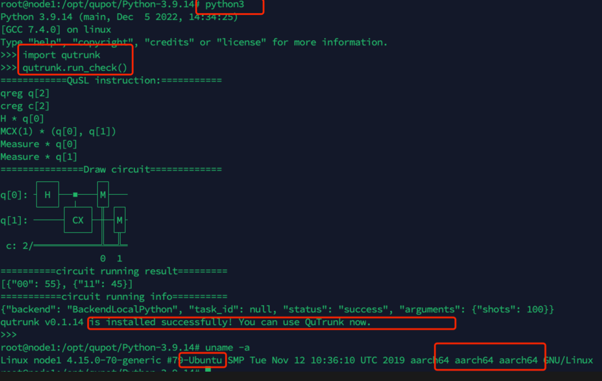
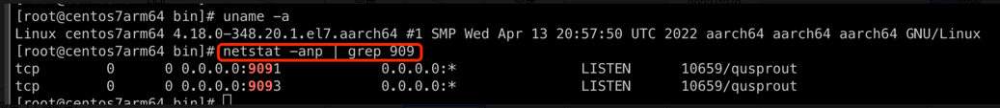
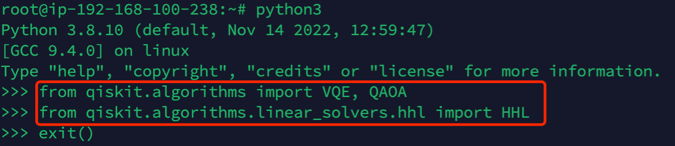
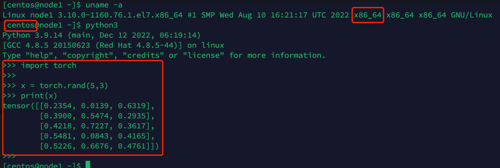
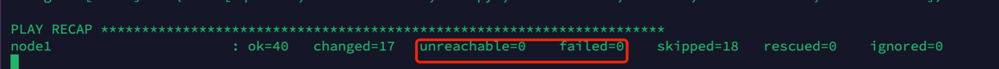

# 应用环境安装说明

---

目前所支持的环境
<table>
    <tr>
        <td colspan='2' rowspan="2"></td>
        <td colspan='2'>Ubuntu&nbsp;20/22</td>
        <td colspan='2'>CentOS&nbsp;7</td>
        <td rowspan="2">安装命令</td>
    </tr>
    <tr>
        <td>ARM</td>
        <td>AMD</td>
        <td>ARM</td>
        <td>AMD</td>
    </tr>
    <tr>
        <td rowspan="3">驱动（下游硬件）</td>
        <td>NVIDIA GPU 卡</td>
        <td></td>
        <td>✅</td>
        <td></td>
        <td>✅</td>
        <td> rtctl run --playbook 01-nvidia-gpu </td>
    </tr>
    <tr>
        <td>国产 GPU 卡</td>
        <td></td>
        <td></td>
        <td></td>
        <td></td>
        <td></td>
    </tr>
    <tr>
        <td>量子随机数发生器 PCIE-QRNG (Kylin&nbsp;ARM)</td>
        <td></td>
        <td></td>
        <td></td>
        <td></td>
        <td></td>
    </tr>
    <tr>
        <td rowspan="7">算法库（pip 方式）</td>
        <td>QAOA</td>
        <td></td>
        <td>✅</td>
        <td></td>
        <td>✅</td>
        <td rowspan="7">rtctl run --playbook 04-algorithms-lib</td>
    </tr>
    <tr>
        <td>VQE</td>
        <td></td>
        <td>✅</td>
        <td></td>
        <td>✅</td>
    </tr>
    <tr>
        <td>HHL</td>
        <td></td>
        <td>✅</td>
        <td></td>
        <td>✅</td>
    </tr>
    <tr>
        <td>sklean（scikit-learn）</td>
        <td></td>
        <td>✅</td>
        <td></td>
        <td>✅</td>
    </tr>
    <tr>
        <td>tensorflow</td>
        <td></td>
        <td>✅</td>
        <td></td>
        <td>✅</td>
    </tr>
    <tr>
        <td>SciPy</td>
        <td></td>
        <td>✅</td>
        <td></td>
        <td>✅</td>
    </tr>
    <tr>
        <td>pytorch（CPU版本）</td>
        <td></td>
        <td>✅</td>
        <td></td>
        <td>✅</td>
    </tr>
    <tr>
        <td rowspan='2'>量子应用（上游应用）</td>
        <td>QuTrunk</td>
        <td>✅</td>
        <td>✅</td>
        <td>✅</td>
        <td>✅</td>
        <td>rtctl run --playbook 02-qutrunk</td>
    </tr>
    <tr>
        <td>QuSprout</td>
        <td>✅</td>
        <td>✅</td>
        <td>✅</td>
        <td>✅</td>
        <td>rtctl run --playbook 03-qusprout</td>
    </tr>
</table>

<!--  -->

> 建议使用 `Ubuntu20/22` 和  `CentOS7.9` 作为目标主机

##  **部署步骤**
> **配置安装目标主机信息**，具体见文档 [02-Runtime配置说明](./02-runtime_config.md) 
### 1. 在管控机上修改 `/opt/runtime/conf/hosts.hostname.ini` 修改需要安装的 主机和仓库地址等信息





### 2. 查看目前可安装的 `playbook`（1个playbook对应1个环境）

- 显示可运行的环境名称
    ```shell
    $ rtctl list

    runtime list: 
        04-algorithms-lib
        02-qutrunk
        03-qusprout
        01-nvidia-gpu
        00hello
    ```
    
    

## **部署相应环境**
### 1. 安装 `NVIDIA GPU` 环境
```shell
rtctl run --playbook 01-nvidia-gpu
```

### 2. 安装 `QuTrunk` 环境
```shell
rtctl run --playbook 02-qutrunk
```

* 验证

    ```shell
    python3

    import qutrunk

    qutrunk.run_check()
    ```

* 显示 `qutrunk` 安装成功  


### 3. 安装 `QuSprout` 环境

```shell
rtctl run --playbook 03-qusprout
```

* 安装完成后，需要启动 `QuSprout` 服务。 启动 `QuSprout` 服务：
    ```shell
    sudo ./service_qusprout.sh start qusprout
    ```

* 查看 `QuSprout` 运行状态
    ```shell
    netstat -anp | grep 909
    ```
    

### 4. 安装算法库环境
支持的算法库如下
- QAOA
- VQE
- HHL
- sklean（scikit-learn）
- tensorflow
- SciPy
- pytorch（CPU版本）

    ```shell
    rtctl run --playbook 04-algorithms-lib
    ```

- **验证算法环境例子**

    * 验证 `VQE、QAOA、HHL`

        

    * 验证 `torch`

        

### 5. 安装量子随机数发生器 PCIE-QRNG 环境
> 确保目标主机已插入随机数卡，否则可能会导致安装失败
```shell
rtctl run --playbook 05-pcie-qrng.yml
```
### 6. 查看执行安装 `Runtime` 日志

- 如执行结果中，`unreachable=0 failed=0`，则表示执行成功

